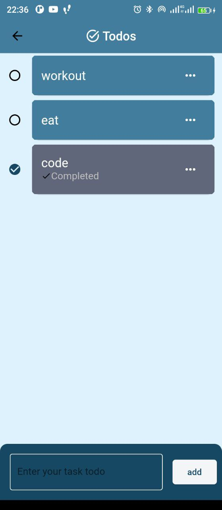

# NOTES_APP

A simple notes app with extra features

## Table of contents

- [Screenshot](#screenshot)
- [Built with](#built-with)
- [Features](#features)
- [Useful resources](#useful-resources)
- [Author](#author)
- [Feedback](#feedback)

### Screenshot

### Built with

- Flutter
- Dart
- Bloc state management
- Shared preferences(local storage)

### Features

1. **Cross-Platform Compatibility:**

   - Works seamlessly on both Android and iOS platforms.

2. **User-Friendly Interface:**

   - Intuitive design for easy navigation and task management.

3. **Task Management:**

   - Create, read, update, and delete (CRUD) notes and tasks.

4. **Light and Dark Mode:**

   - Toggle between light and dark mode based on user preference.

5. **Offline Usage:**
   - Access and manage tasks even without an internet connection.

### Useful resources

- [Bloc for state management](https://youtu.be/SDk_GldOtK8?si=NXnesVTmIGCNM3Hp) - Although, I didn't learn bloc through this resource, Its relatively new and updated so I'd I'd recommend it to anyone struglling with bloc or just wants to get started.
- [Shared Preferences](https://youtu.be/szOllHT1S7Y?si=RjeXsmQLpugX2EVx) - This is a 10 mins tutorial that covers the basics of shared preferences. Its where I learnt so, watch if you're interested.

## Author

- Github - [JER3MIAH](https://github.com/)
- Twitter - [@jeremiah_008](https://twitter.com/jeremiah_008)

## Feedback 

Reach out to me at [mail](jeremiah.devv@gmail.com)